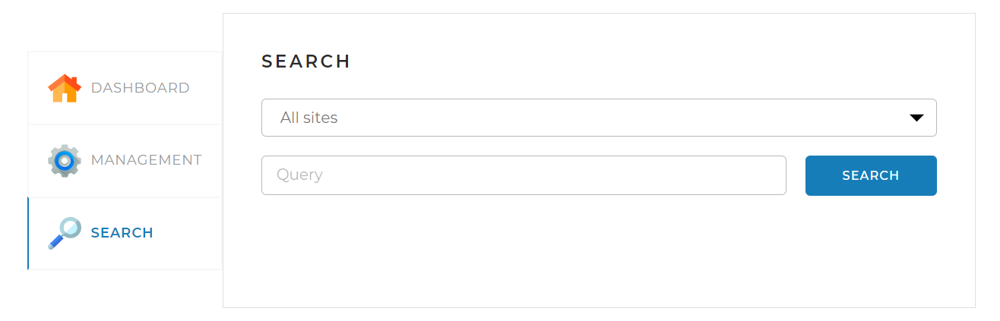

# SearchEngine
Search engine realization. Allows:
* parse web-sites
* get lemmas from pages
* store info about found lemmas in the DB(mysql)
* create snippets with most relevant results according to user's request
## Tech info
* Java 17
* MySQL 8
* JSOUP
* Lucene
* Spring boot 2.7.1
## Instructions for running the app:
### Filling application.yaml in:
* Fill in the section with sites to index:

* Fill in the fields with credentials for DB connection:

### Building and running the app using Maven:
```shell
mvn install
```
```shell
java -jar SearchEngine-*.jar
```
### Using the app:
* By default, the application will run locally at http://localhost:8080
#### Management:
* Command `START INDEXING` starts indexing the websites specified in the application.yaml
* Command `STOP INDEXING` terminates all sites indexing
* Command `Add/update page` starts indexing the specified page

#### Dashboard:
* Displays indexing performance statistics

#### Search:
* Allows searching for matches with the search query on the pages

* Query example:

